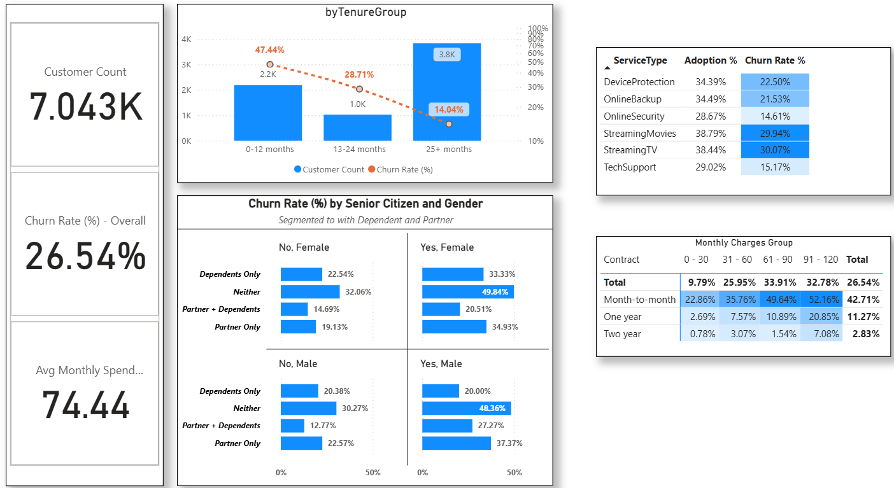
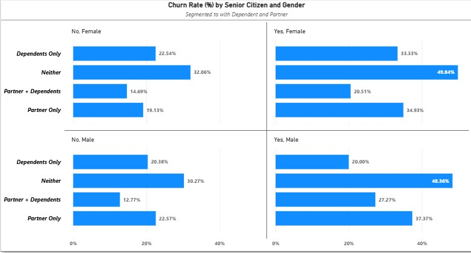
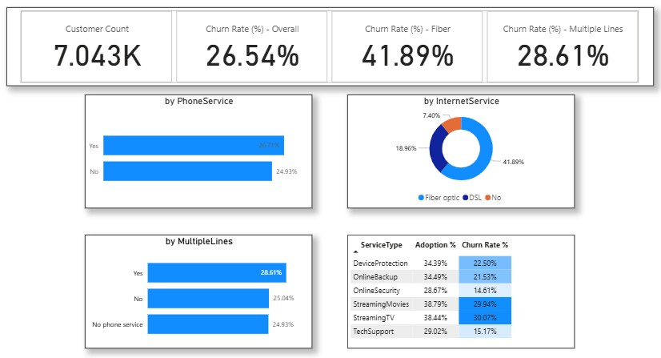
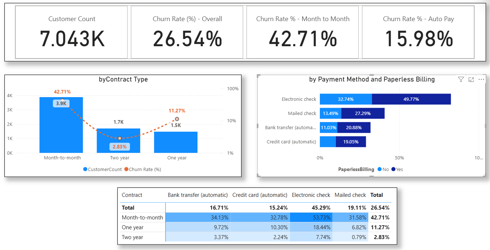
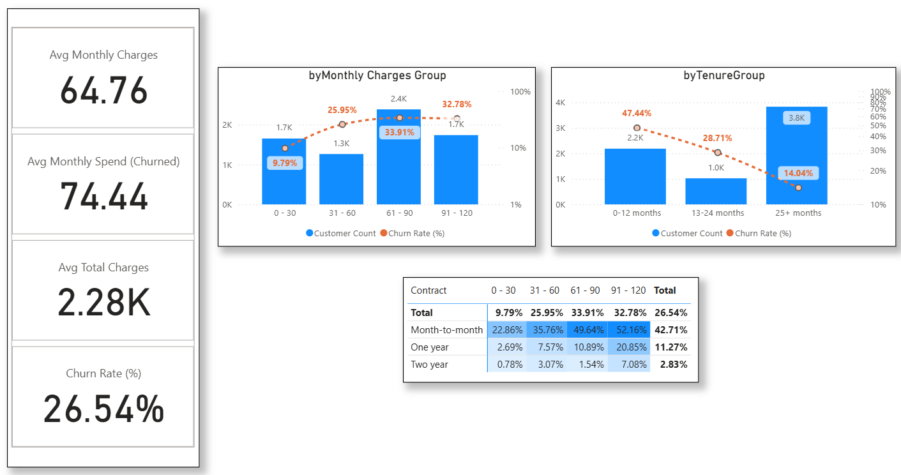

# **Project Background**

This project uses the Telco Customer Churn dataset from Kaggle, which includes customer account information, demographics, subscribed services, billing details, and churn status.

For this analysis, I frame it as a case study of a telecommunications company that provides internet, phone, and streaming services. The company operates primarily on a monthly subscription model, generating revenue from recurring service charges.

Recently, the company has observed an increase in customer cancellations (churn). Because churn directly affects revenue and customer lifecycle, management has requested an in-depth analysis to:

  1. Understand the key drivers of churn

  2. Identify high-risk customer segments

  3. Recommend actionable strategies to improve retention

As the data analyst, my role is to deliver data-driven insights that management can use to design effective retention campaigns and strengthen long-term customer loyalty.

# **Data Cleaning & Preparation**

All data cleaning and transformation were conducted in **Power Query** (within Power BI).

Key Steps Taken:
- Trimming whitespace and cleaning text fields (service categories, gender, etc.)
- Converting `TotalCharges` from text to numeric
- Creating derived features:
  - `AverageMonthlySpend = TotalCharges ÷ max(Tenure, 1)`
  - `TenureGroup` buckets: 0–12, 13–24, 25+ months
- Removing duplicate records (none found)
- Checking and validating numeric ranges (no negative or anomalous values detected)

After cleaning, the dataset contained ~7,000 unique customers and was ready for analysis.

# **Interactive Dashboard**

The Power BI dashboard allows stakeholders to explore churn trends dynamically across demographics, services, contracts, billing, and financial metrics.
Key features:
- Drill-down and filter by customer segments  
- Visuals include cards, bar charts, matrix heatmaps, scatter plots, and trend lines
- Uploaded here in github

# **Key Analysis Categories**

Insights and recommendations are organized around these areas:
1. **Customer Demographics** — age, gender, partner/dependent status  
2. **Services Subscribed** — phone, internet, multiple lines, VAS  
3. **Contract & Billing** — contract types, payment & billing methods  
4. **Financial Metrics** — monthly charges, average monthly spend, total lifetime charges

Each section includes cards, charts, and matrices to highlight key churn drivers.

# **Data Structure & Initial Checks**

The analysis is based on a **single merged table** of ~7,043 customer records, with columns like:

| Column            | Description |
|-------------------|--------------|
| CustomerID         | Unique customer identifier |
| Gender             | Male / Female |
| SeniorCitizen       | Yes / No |
| Partner             | Yes / No |
| Dependents          | Yes / No |
| PhoneService         | Yes / No |
| MultipleLines        | Yes / No / No Phone Service |
| InternetService      | DSL / Fiber / None |
| Contract            | Month-to-Month / One-Year / Two-Year |
| PaymentMethod        | Electronic / Check / Transfer / Credit Card |
| PaperlessBilling     | Yes / No |
| MonthlyCharges       | Numeric, recurring monthly fee |
| TotalCharges          | Numeric, lifetime charges to date |
| Churn               | Yes / No |
| Tenure              | Number of months as a customer |
| AverageMonthlySpend   | Derived field |
| TenureGroup          | Derived bucket |

Initial checks included verifying missing and out-of-range values, ensuring correct data types, and validating feature logic.

# **Executive Summary**

Overview of Findings

This analysis identifies key drivers of churn for the telecommunications company, focusing on customer demographics, service subscriptions, contract & billing, and financial metrics. Stakeholders should note three main insights:
  1. Demographics Matter: Senior citizens who are single and without dependents show the highest churn, highlighting household status as a key retention factor.
  2. Service Adoption Impacts Risk: Customers with Fiber Internet, multiple lines, or specific value-added services like Streaming TV are more likely to churn, indicating dissatisfaction or competitive pressures in these segments.
  3. Contract & Financial Levers Influence Churn: Month-to-Month contracts, especially with high monthly charges, present the highest churn risk, whereas longer-term contracts and automatic payment methods improve retention.

Implication for Stakeholders: Retention campaigns should focus on high-risk demographic segments, optimize service bundles for satisfaction, and incentivize longer-term contracts or auto-pay adoption.

# **Insights Deep Dive**

Category 1: Customer Demographics (e.g., senior citizens, gender distribution)

Main Insight 1
  * Observation: The segment with the highest churn rate is Senior Citizen, Female, without Dependents or Partner, at 49.48%, followed closely by the same segment for Male, at 48.36%.
  * Interpretation: Older customers who are single and have no dependents are the most likely to leave the service.
  * Supporting Analysis: Across the Small Multiples chart (4 panels: Senior/Non-Senior × Male/Female), this segment consistently shows the tallest bars, indicating persistent churn risk.

Main Insight 2
  * Observation: Customers without a Partner or Dependents have the highest churn rates, while those with either or both have the lowest churn.
  * Quantitative Values:
    * “Neither” segment: ~30–49% churn
    * “Partner Only”, “Dependents Only”, or “Partner + Dependents” segments: 12–37% churn
  * Interpretation: Household connections (partner or dependents) appear correlated with higher retention

Main insight 3
  * Observation: Gender differences exist but are minor compared to household status.
  * Quantitative Comparison: Female Senior Citizens without Partner/Dependents: 49.48%; Male Senior Citizens without Partner/Dependents: 48.36%.
  * Interpretation: While females in this demographic have slightly higher churn, the primary driver remains the absence of dependents or partner.

Category 2: Services Subscribed (phone, internet, multiple lines)

Main Insight 1 – Customer Base Profile
  * The primary services are Phone, Internet, and Value-Added Services (VAS), covering ~7,000 customers in total.

Main Insight 2 – Overall vs. Key Service Churn
  * Overall churn rate: 26.54%
  * Customers with Fiber Internet show a much higher churn rate of 41.89%, suggesting stronger competition or service dissatisfaction.
  * Those with Multiple Lines also have an elevated churn rate of 28.61%, slightly above the overall average.

Main Insight 3 – Internet Service Effect
  * Customers without Internet service have the lowest churn at only 7%, highlighting internet-related services as a primary churn driver.

Main Insight 4 – Service-Specific Risk
  * Customers with Multiple Lines churn at a rate similar to those with no Phone service, signaling that extreme ends of service adoption (none vs. many) both present risk.
  * Among value-added services, Streaming TV exhibits the highest churn rate at 30%, making it the most vulnerable VAS segment.

Category 3: Contract & Billing (monthly vs. long-term contracts, payment methods)

Main Insight 1 – Contract Type Risk  
  * Month-to-Month customers show the highest churn rate, reflecting the ease of cancellation without commitment.
  * One-Year and Two-Year contracts exhibit significantly lower churn, demonstrating the retention benefit of longer commitments.

Main Insight 2 – Billing Method Impact
  * Customers using Electronic Billing, particularly those paying via electronic check, experience higher churn rates.
  * This suggests that paperless billing alone does not guarantee retention if payment methods remain manual or friction-prone.

Main Insight 4 – Payment Method Patterns
  * Automatic Payment (Auto-Pay) customers—via credit card or bank transfer—show the lowest churn rates, thanks to reduced payment friction.
  * Manual methods such as electronic check or mailed checks remain high-risk segments.

Category 4: Financial Metrics (MonthlyCharges, AverageMonthlySpend, TotalCharges)

Main Insight 1 – Average Charges Profile
  * Observation: The average monthly charges across all customers is ₱64.76, while churned customers have a higher average of ₱74.44, indicating that higher-paying customers are slightly more likely to churn.
  * Total Charges: Average lifetime charges is ₱2,280, suggesting most customers have relatively moderate total spend.
  * Interpretation: Monthly charges may act as a risk indicator; higher monthly fees correlate with higher churn.

Main Insight 2 – Monthly Charge Bands
  * Observation: Customers in the ₱61–90/month band are the largest group (~2,400 customers) and also show the highest churn (33.91%).
  * Interpretation: This price band is both high in volume and high risk; targeted retention or incentives may reduce churn.

Main Insight 3 – Tenure Group Analysis
  * Observation: Most customers are in the 25+ months tenure group (~3,800 customers) with the lowest churn (14.04%).
  * Interpretation: Longer-tenured customers are more loyal. Retention strategies can prioritize newer customers (0–12 months or 13–24 months) who show higher churn risk.

Matrix Insight 4 – Contract Type × MonthlyCharge Band
  * Observation: Month-to-Month customers are the riskiest segment, especially those in the ₱91–120 monthly charge band, with a churn rate of 52.16%.
  * Interpretation: Flexible contracts combined with high monthly charges represent the highest risk of churn. In contrast, customers on One-Year or Two-Year contracts, even with similar monthly charges, show lower churn rates.
  * Actionable Insight: Retention campaigns should prioritize Month-to-Month customers in high-charge bands, possibly offering incentives to switch to longer-term contracts or providing value-added services to improve stickiness.

# **Recommendations**

  1. Target High-Risk Demographics
     * Observation: Senior Citizen customers, especially those without a Partner or Dependents, show the highest churn (~49%).
     * Recommendation: Launch retention campaigns targeting this segment, such as personalized loyalty offers, bundled services, or proactive customer support.

  2. Focus on Service-Specific Churn Drivers
     * Observation: Customers with Fiber Internet or Multiple Lines have higher churn rates (Fiber: 41.89%, Multiple Lines: 28.61%).
     * Recommendation: Conduct service satisfaction surveys and improve service quality for these offerings; consider promotional incentives to retain high-risk customers.

  3. Mitigate Contract & Billing Churn Risks
     * Observation: Month-to-Month customers, especially with high monthly charges, show elevated churn.
     * Recommendation: Encourage longer-term contracts with incentives, provide payment flexibility, or highlight value-added services to reduce churn.
  
  4. Financial Metrics-Based Retention
     * Observation: High spenders with short tenure (high Monthly Charges, low Total Charges) are at risk.
     * Recommendation: Identify new, high-value customers for early engagement programs, offer personalized onboarding or discounts to reduce early churn.

  5. Value-Added Services (VAS) Optimization
     * Observation: Streaming services have the highest VAS churn (~30%).
     * Recommendation: Offer bundled content, loyalty programs, or targeted promotions to retain VAS customers.

# **Assumptions and Caveats**

  1. Missing values for certain columns (e.g., TotalCharges) were assumed to be $0 for calculation purposes.
  2. Customer tenure groups (0–12, 13–24, 25+ months) were created for segmentation; exact monthly patterns may vary.
  3. Churn rate percentages are based on available historical snapshot; no temporal (month-to-month) trend was included.
  4. Certain outliers (e.g., extremely high MonthlyCharges) were retained to reflect real customer risk, but may skew averages.
